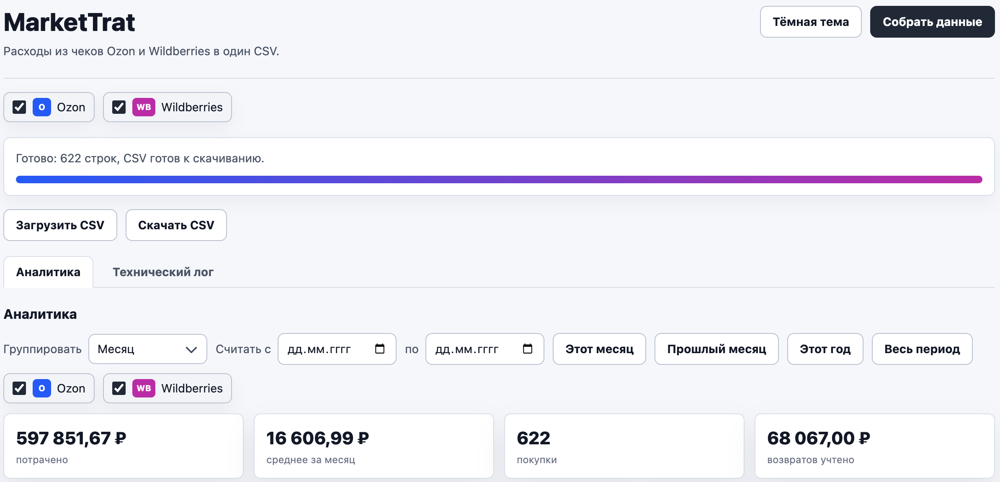
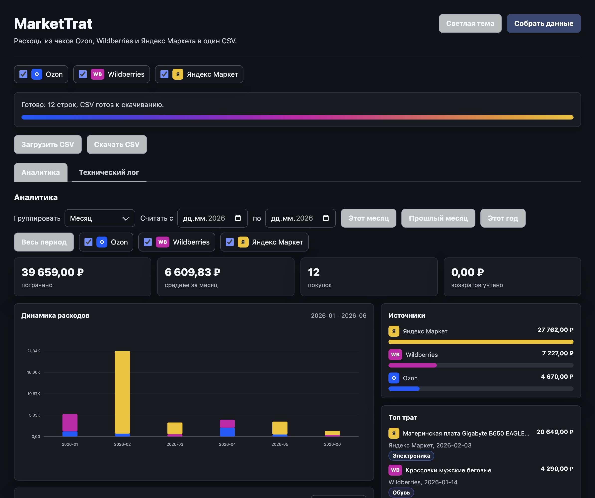

# MarketTrat

Локальное расширение для Chrome, Edge и Yandex Browser. Собирает расходы из чеков Ozon, Wildberries и Яндекс Маркета, учитывает возвраты и выгружает CSV.

Текущий релиз: `0.8.0`.

Данные никуда не отправляются: всё работает внутри браузера.
Расширение запрашивает только метаданные GitHub Releases и публичный словарь категорий; данные расходов не отправляются.

## Скриншоты





## Что умеет

- собирает чеки Ozon, Wildberries и Яндекс Маркета;
- разбирает товары, даты и суммы;
- показывает возвраты отдельными строками и учитывает их в итогах;
- убирает сервисные строки доставки и сборов, где они не относятся к товарам;
- проставляет категории по названию товара простыми локальными правилами;
- подтягивает обновления словаря категорий из GitHub без отправки покупок;
- показывает простую аналитику;
- скачивает CSV для Excel, Google Sheets или личного бюджета.

CSV:

```text
date,marketplace,title,amount,currency,category,type,marketplace_id,item_index
```

## Установка

1. Скачайте `markettrat-extension.zip` из GitHub Releases.
2. Распакуйте архив.
3. Откройте `chrome://extensions`.
4. Включите `Режим разработчика`.
5. Нажмите `Загрузить распакованное расширение`.
6. Выберите распакованную папку с файлом `manifest.json`.

Если скачали исходники, выбирайте папку `extension`.

## Использование

1. Войдите в Ozon, Wildberries и Яндекс Маркет в этом же профиле браузера.
2. Нажмите иконку `MarketTrat`.
3. Выберите нужные источники.
4. Нажмите `Собрать данные`.
5. Нажмите `Скачать CSV`.

Если маркетплейс открыл страницу входа, залогиньтесь и запустите сбор ещё раз.

## Ограничения

- Распакованное расширение не обновляется браузером само: при новой версии появится ссылка на GitHub Releases.
- Маркетплейсы могут менять страницы и внутренние API. Тогда расширение может временно сломаться.
- Ozon PDF разбирается только если внутри есть текстовый слой.
- Яндекс Маркет может отдавать несколько чеков на заказ; дубли предоплаты отбрасываются, если найден полный расчёт.
- Категории определяются простыми правилами и могут ошибаться.

## Для разработки

```bash
node extension/categories.test.js
node extension/wb.test.js
node extension/yandex.test.js
node extension/csv.test.js
```

## Лицензия

MIT. PDF.js внутри `extension/vendor` распространяется под Apache-2.0.
